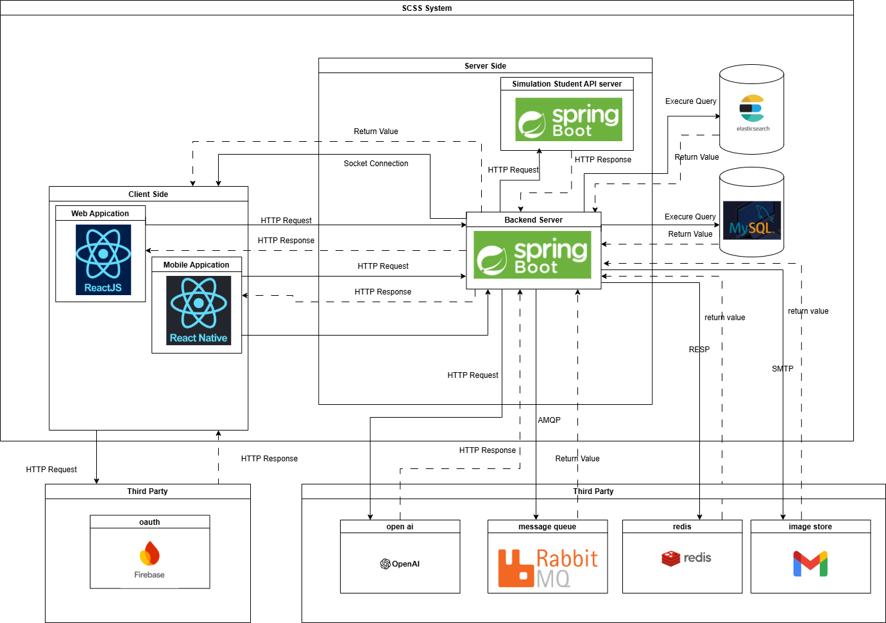

# Student Counseling and Support System with Advanced Search at FPTU HCM Campus (SCSS)

Developed and implemented a system to connect students with suitable advisors based on their counseling needs, leveraging OpenAI's API to enhance the functionality. The system also enables FPTU staff to identify students who may face academic challenges and need support, facilitating timely reminders and assisting in connecting students with appropriate advisors
- Note: The system aims to integrate with the FPT university's server to leverage student data, enabling the implementation of the advanced search feature based on students' academic progress, further enhancing personalized support and intervention capabilities.
## Table of Contents

- [Features](#features)
- [Overall System Architecture](#overall-system-architecture)
- [Prerequisites](#prerequisites)
- [Installation](#installation)
- [Running the Application](#running-the-application)
    - [Development Environment](#development-environment)
    - [Development Environment Integrating With Front-End](#development-environment-integrating-with-front-end)
    - [Production Environment](#production-environment)
    - [Run .Jar file after being built by using maven](#run-jar-file-after-being-built-by-using-maven)
- [API Documentation](#api-documentation)

## Features

- **Advisor Matching:** Utilized AI to align student counseling objectives with suitable advisors, ensuring personalized guidance.
- **Question Recommendation:** When students ask a question, the system uses AI to recommend similar questions asked by other students or relevant answers from the FAQ, helping students find immediate, relevant information without waiting for a response.
- **Advanced Search for Staff:** Developed an advanced search feature that allows FPTU staff to easily identify students at risk based on their academic performance, helping staff provide targeted support and connect them with the right advisors.

## Overall System Architecture

## Prerequisites

- **Java 21** or higher
- **Maven 3.9.8** or higher
- **Git** (for version control)

## Installation

1. **Clone the repository**:
   ```sh
   git clone https://github.com/trinhvinhphat2003/capstone-backend.git
   cd capstone-backend
2. **Install dependencies and build the project**:
    ```sh
   mvn clean install
## Running the Application

### Development Environment

To run the application in the development environment, follow these steps:
1. **Run Docker Compose**:
   Before starting the application, ensure that the necessary services (MySQL, Redis, and RabbitMQ) are running. Use Docker Compose to set up these services:

   ```sh
   docker-compose -f docker-compose.dev.yml up -d
2. **Run the application**:
   ```sh
   ./mvnw spring-boot:run --define spring-boot.run.arguments="--spring.profiles.active=dev"
### Development Environment Integrating With Front-End

To run the application in the development environment, follow these steps:
1. **Build scss server**:
   ```sh
   docker build -f Dockerfile.frontend -t trinhvinhphat2003/capstone-backend-server-fe .
2. **Push scss server**:
   ```sh
   docker push trinhvinhphat2003/capstone-backend-server-fe:latest
3. **Build mobile socket server**:
   ```sh
   docker build -t trinhvinhphat2003/mobile-socket-capstone-server .
4. **Push mobile socket server**:
   ```sh
   docker push trinhvinhphat2003/mobile-socket-capstone-server:latest
5. **Build fap system server**:
   ```sh
   docker build -f Dockerfile.frontend -t trinhvinhphat2003/fap-system-server .
6. **Push fap system server**:
   ```sh
   docker push trinhvinhphat2003/fap-system-server:latest
7. **Run Docker Compose**:
   This is what FE team have to do to run server:

   ```sh
   docker-compose -f docker-compose.fe.yml up -d
### Production Environment

To run the application in the production environment, follow these steps:
1. **Run the application**:
   ```sh
   ./mvnw spring-boot:run --define spring-boot.run.arguments="--spring.profiles.active=prod"
### Run .Jar file after being built by using maven
1. **Run with /dev/ profile**:
   ```shell
   java -jar scss-0.0.1-SNAPSHOT.jar --spring.profiles.active=prod
2. **Run with /prod/ profile**:
   ```sh
   java -jar scss-0.0.1-SNAPSHOT.jar --spring.profiles.active=prod
## API Documentation

The project includes Swagger for API documentation. Swagger provides an interactive interface to explore and test the API endpoints.

To access the API documentation:

1. **Start the Application**:
   Ensure the application is running. For development, use the `dev` profile:
   ```sh
   ./mvnw spring-boot:run --define spring-boot.run.arguments="--spring.profiles.active=dev"
2. **Open the Swagger UI**:
   Navigate to http://localhost:8080/swagger-ui.html in your web browser. This will display the Swagger UI where you can view the available API endpoints, their descriptions, and try out requests interactively.
3. **Explore Endpoints**:
   Use the Swagger UI to browse through the various endpoints, view request parameters, and see example responses. This interactive documentation helps you understand how to interact with the API and test its functionality.